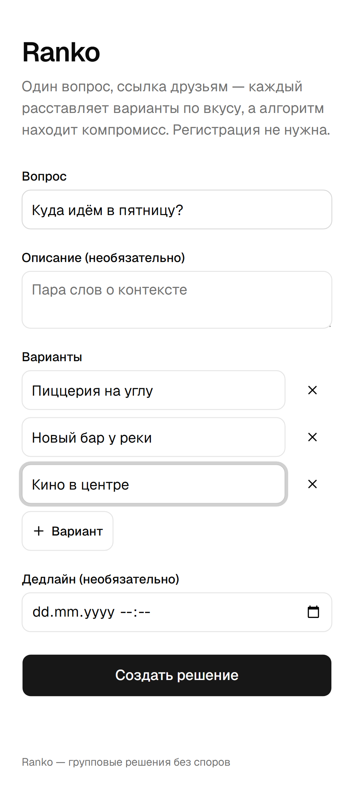
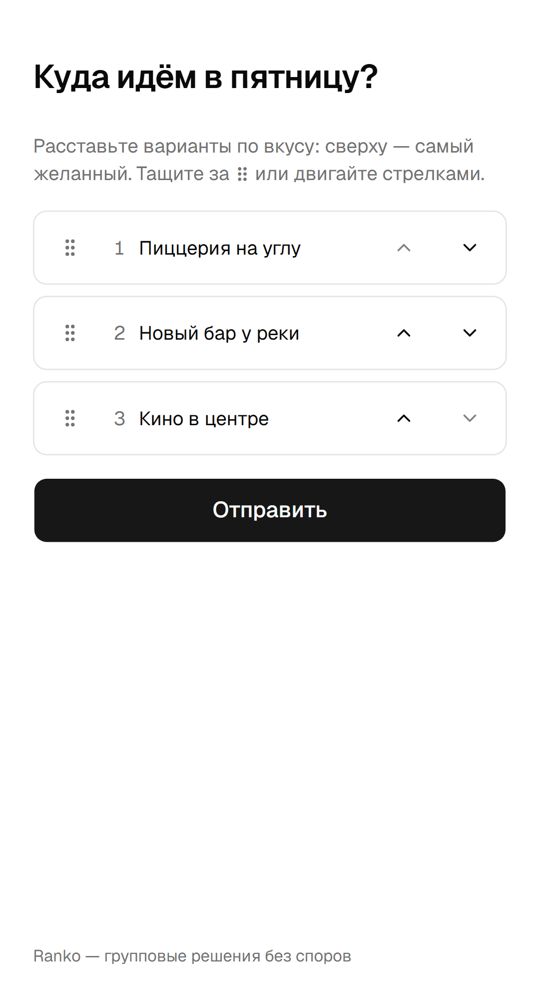
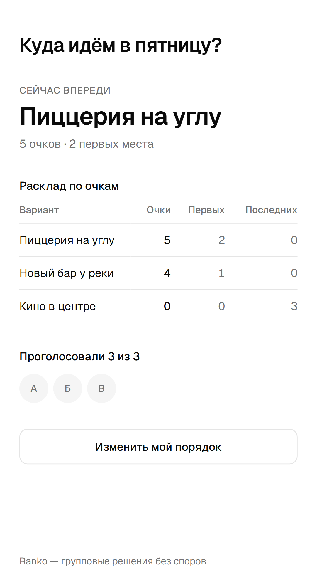

# Ranko

Групповые решения без сорока сообщений «ну а ты что хочешь?».

Один человек заводит вопрос с вариантами и кидает ссылку в чат. Каждый за полминуты расставляет
варианты по вкусу: без регистрации, без приложения, прямо в браузере телефона. Алгоритм считает
компромисс и показывает, кто победил и почему.

## Зачем

При выборе ресторана или фильма в общем чате побеждает тот, кто дольше всех готов спорить.
Обычный опрос «за что ты?» проблему не решает: он показывает только первые места и молчит
о том, что для половины чата победитель — худший вариант из возможных.

Ranko спрашивает не «что нравится», а «в каком порядке» — и находит то, что устраивает всех.

## Как выглядит

| Создать | Проголосовать | Результаты |
|---|---|---|
|  |  |  |

Скриншоты снимаются с живого приложения — `npm run screenshots` проходит путь человека
(создать → проголосовать → результаты) и переснимает все три.

## Как считается компромисс

Метод Борда — его можно объяснить участнику одной строкой:

> Вариант получает тем больше очков, чем выше он в твоём списке. Побеждает тот, у кого сумма больше.

Точнее: при N вариантах вариант на позиции k получает `N − k` очков — верхний даёт `N − 1`,
нижний `0`. Побеждает максимум суммы. Ничьи разводим по порядку: больше первых мест → меньше
последних мест → детерминированный выбор с сидом от slug решения (чтобы победитель не «прыгал»
при каждом обновлении страницы).

Поэтому вариант, которого никто не назвал первым, но никто и не задвинул в конец, обходит любимца
меньшинства. Алгоритм живёт в [src/lib/borda.ts](src/lib/borda.ts) чистой функцией и покрыт
тестами, включая тай-брейки и случаи с 0 и 1 участником.

## Стек

| Слой | Выбор |
|---|---|
| Фреймворк | Next.js (App Router) + TypeScript strict |
| UI | Tailwind CSS + shadcn/ui, mobile-first |
| Drag & drop | dnd-kit + кнопки ↑/↓ как равноценный fallback |
| БД | Postgres (Neon) + Drizzle ORM, миграции drizzle-kit |
| Драйвер БД | Neon HTTP — обычный TCP-`pg` на Vercel исчерпал бы лимит соединений |
| Валидация | zod на каждой границе API |
| Данные на клиенте | SWR с поллингом раз в 4 секунды |
| Тесты | Vitest (юниты и ручки на PGlite) + Playwright (сквозной сценарий) |
| Деплой | Vercel |

## Приватность

Аккаунтов нет вообще. Личность участника — токен в localStorage и httpOnly-cookie, право админа —
знание admin-токена из ссылки. Токены не логируются и никогда не отдаются в GET-ответах.
Аналитики и сторонних счётчиков нет — поэтому нет и баннера про cookies: согласовывать нечего.

## Локальный запуск

Нужен Node 20+ и база Postgres (проще всего — бесплатный проект в [Neon](https://neon.tech)).

```bash
npm install
cp .env.example .env.local   # и подставить DATABASE_URL
npx drizzle-kit migrate      # накатить схему
npm run db:seed              # необязательно: демо-решение на /d/demo-fri
npm run dev
```

Открыть http://localhost:3000.

## Переменные окружения

Все описаны с комментариями в [.env.example](.env.example). Обязательная ровно одна:

| Переменная | Обязательна | Зачем |
|---|---|---|
| `DATABASE_URL` | да | Postgres (Neon), pooled-строка |
| `NEXT_PUBLIC_SITE_URL` | в проде | Абсолютный адрес для ссылок на OG-превью |
| `UPSTASH_REDIS_REST_URL` / `_TOKEN` | в проде | Rate limit на создание, общий для всех инстансов; без них лимит живёт в памяти процесса и на Vercel дырявый |
| `NEXT_PUBLIC_FEEDBACK_EMAIL` | нет | Почта для ссылки «Написать автору». Пусто — ссылки нет |

## Команды

```bash
npm run dev          # dev-сервер
npm run lint         # eslint
npm run typecheck    # tsc --noEmit
npm run test         # vitest: юниты + ручки на PGlite в памяти
npm run test:e2e     # playwright: сквозной сценарий (нужен dev-сервер и живая база)
npm run metrics      # метрики продукта по базе (см. ниже)
npm run screenshots  # переснять картинки для README (нужен dev-сервер)
npm run db:generate  # сгенерировать миграцию по изменённой схеме
npm run db:migrate   # накатить миграции
npm run db:seed      # демо-решение
```

## Деплой

Vercel + Neon, ноль ops. Порядок:

1. Завести проект в Neon, скопировать **pooled**-строку подключения.
2. Импортировать репозиторий в Vercel — Next.js определится сам, настраивать сборку не нужно.
3. Прописать переменные окружения в Vercel (см. таблицу выше). `NEXT_PUBLIC_SITE_URL` — боевой
   адрес: без него превью-деплои будут подставлять в OG-разметку свои временные адреса.
4. Накатить схему на прод-базу: `DATABASE_URL=<прод> npx drizzle-kit migrate`.
5. Проверить живьём: создать решение, кинуть ссылку в мессенджер (развернётся ли OG-превью),
   проголосовать с телефона.

## Метрики

Продукт работает, если решения доводят до конца. `npm run metrics` отвечает на три вопроса прямо
по базе: сколько решений создано, в скольких набралось три и больше проголосовавших, сколько дошло
до «закрыто». Метрики успеха из PLAN.md именно такие: они про судьбу конкретного решения,
и внешний счётчик на них не отвечает.

Стороннюю аналитику намеренно не подключали: за картинку трафика пришлось бы платить или
поднимать свой инстанс, а вопрос «работает ли продукт» закрывается запросом к базе.

## Что дальше

Сознательно не вошло в v0.1: опросы по датам, право вето, предложение вариантов участниками,
делёжка расходов, Telegram-бот, аккаунты и история решений. Полный список и рамки фаз —
в [PLAN.md](PLAN.md).
